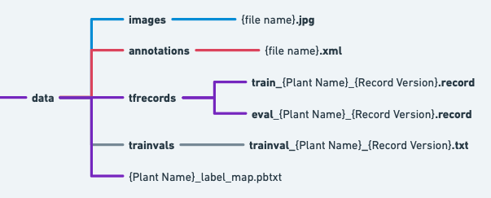

# Tensorflow Installation

## Dependencies

Tensorflow Object Detection API depends on the following libraries:

*   Protobuf 3.0.0
*   Python-tk
*   Pillow 1.0
*   lxml
*   tf Slim (which is included in the "Classroom/computer_vision/object_detection" directory)
*   Jupyter notebook
*   Matplotlib
*   Tensorflow (>=1.9.0)
*   Cython
*   contextlib2
*   cocoapi

For detailed steps to install Tensorflow, follow the [Tensorflow installation
instructions](https://www.tensorflow.org/install/). A typical user can install
Tensorflow using the following command:

``` bash
pip install tensorflow
```

The remaining libraries can be installed using pip:

``` bash
pip install --user Cython
pip install --user contextlib2
pip install --user pillow
pip install --user lxml
pip install --user jupyter
pip install --user matplotlib
pip install --user protobuf
pip install --user pycocotools
```


## Add Libraries to PYTHONPATH

When running locally, the Classroom/computer_vision/object_detection and slim directories
should be appended to PYTHONPATH. This can be done by running the following from
Classroom/computer_vision/object_detection:


``` bash
# From Classroom/computer_vision/object_detection
export PYTHONPATH=$PYTHONPATH:`pwd`:`pwd`/slim
```

# Creating TensorFlow Records

Tensorflow Object Detection API reads data using the TFRecord file format. There are a few things we need to prepare before we can generate the TFRecords. Follow the instructions below to convert a set of images and annotations into TFRecords, which can be used to train an Tensorflow Object Detection model. 

## Download the Images and Annotations

Download the data from [here](https://www.dropbox.com/s/5oph6gx38s2zw8y/cassava_data.zip?dl=0) and extract it. There should be 200 files (100 images and 100 annotations) per class for 3 classes, totalling 600 files. 

## Create the Label Map File

Create a text file in protobuf format called `cassava_label_map.pbtxt` and list all class label names and corresponding label IDs. Use the following format for each class in the `cassava_label_map.pbtxt` file:  
```bash
item {  
  id: 1  
  name: 'ClassLabel_1'  
}  

item {  
  id: 2  
  name: 'ClassLabel_2'  
}

item {  
  id: 3  
  name: 'ClassLabel_3'  
}
```
* Be sure to replace `ClassLabel_1`, `ClassLabel_2`, and `ClassLabel_3` with the correct label names. You can find the label names within the xml files. There are 3 differrent labels corresponding to the 3 classes we will be using. You can assign any id (1-3) to any label name.  

## Create the Trainval File

Before creating the TFRecords, we need to specify the list of files that need to be added to the TFRecord. This list is called the trainval list and is stored in the trainval txt file. In order to keep track of the crop and version of each TFrecord we create, we need to specify the crop and version in the trainval filename that was used to create the TFRecord.

In this assignment, you will be creating a trainval for cassava and it will be version 1. Therefore, create a text file called `trainval_cassava_1.txt`. Within the file, list all of the filenames (without extensions) that you would like to be included in the TFRecord. Your trainval file should look similar to this:
``` bash
CassavaBSD_1  
CassavaBSD_2  
CassavaBSD_3  
CassavaMD_1  
CassavaMD_2  
CassavaMD_3
...
```

## Set up the Folder Structure

Create a series of folders and structure them according to the following structure:  

– data: (outermost folder containing folders for annotations, images, trainvals and the cassava_label_map.pbtxt).  
&nbsp;&nbsp;&nbsp;&nbsp;&nbsp;&nbsp;– images: (contains the image files in jpg format)  
&nbsp;&nbsp;&nbsp;&nbsp;&nbsp;&nbsp;– annotations (contains all the annotation files in xml format)  
&nbsp;&nbsp;&nbsp;&nbsp;&nbsp;&nbsp;– trainvals (contains the collection of trainval files)  
&nbsp;&nbsp;&nbsp;&nbsp;&nbsp;&nbsp;– tfrecords (contains the generated TF Records)  

Here is a visualization showing how the various folders and files should be nested within the `data` folder



## Clone the Github Repository
Execute the following command to clone the PlantVillage Classroom github repository containing the code you will use to create the TFRecords. Be sure to `cd` through the terminal to the local directory where you intend to download (clone) the repository before executing the `git clone` command.

```bash
git clone https://github.com/PlantVillage/Classroom.git
```

## Generate the TFRecord files.

```bash
# From Classroom/computer_vision/object_detection
python object_detection/create_tf_record.py \
	--images_dir={PATH_TO}/images \
	—-annotations_dir={PATH_TO}/annotations \
	--trainval_dir={PATH_TO}/trainvals \
	--label_map_path={PATH_TO}/cassava_label_map.pbtxt \
	--output_dir={PATH_TO}/tfrecords \
	--version=1 \
	--model=ssd \
	--crop=cassava \
	--group=False
```

* Note: You need to replace the `{PATH_TO}` variable with the true path to your files and directories. Do not change the values for the `version`, `model`, `crop`, and `group` flags.

If everything was configured correctly, the script will produce two TFRecord files named `cassava_train_1.record` and
`cassava_eval_1.record` and save them in the directory that you specified with the `--output_dir` flag.

## Upload Files

Now that you've created the TFRecords, complete the assignment by uploading the 2 TFRecords, label map and trainval file from your `data` folder to [this](https://www.dropbox.com/scl/fo/xryhtm1u6eyexvojacc7n/h?dl=0&rlkey=sum646wlpkewzojh2bkl3m1g5) folder. DO NOT UPLOAD THE `images` and `annotations`. In order to keep your files seperate from others, create a folder with your name on it and upload the 4 files you generated to that folder. 

[https://www.dropbox.com/s/9rkz9ql1cf782fx/Screen%20Shot%202023-01-24%20at%2012.04.41%20PM.png?dl=0]: https://www.dropbox.com/s/9rkz9ql1cf782fx/Screen%20Shot%202023-01-24%20at%2012.04.41%20PM.png?dl=0