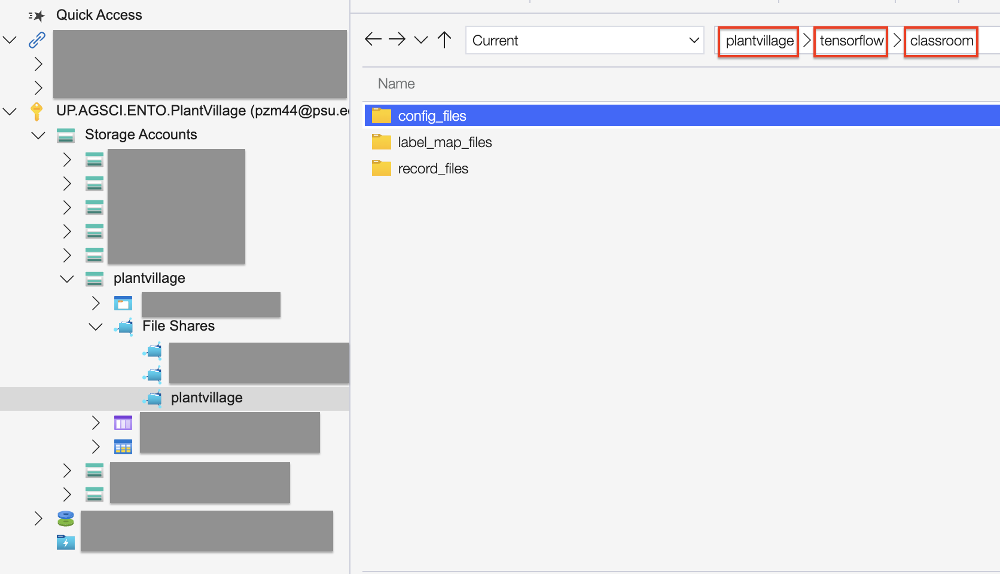

# Training Object Detection Model with Azure MLS

This document walks through the process of training a model using the Tensorflow Object Detection API. We are assuming you already have completeted the following:

1. Installed Azure Command-Line Interface (CLI). You can install the CLI by following [these](https://learn.microsoft.com/en-us/cli/azure/install-azure-cli) instructions.

2. Configured your Azure MLS credentials. You can sign in with Azure CLI by following [these](https://learn.microsoft.com/en-us/cli/azure/authenticate-azure-cli) instructions.

3. Prepared the training and evaluation dataset in the form of TFRecords. You can create your own TFRecords by following [these](https://github.com/PlantVillage/Classroom/blob/d8be8249aa8367f80a8b6351b6d56ba134eba71e/computer_vision/object_detection/object_detection/g3doc/creating_tf_records.md) instructions.

## Prepare Model Config File

### Copy Sample Model Config File

Begin by making a copy of the `ssdlite_mobilenet_v2_coco.config` file that can be found in the `Classroom/computer_vision/object_detection/object_detection/samples/configs` directory. Replace the `_coco` with `_cassava` in the copy you just created so your config file is named `ssdlite_mobilenet_v2_cassava.config`

### Update Config File

Most of the hyperparameters will remain unchanged in the config file. You only need to update the values of `num_classes`, `num_steps`, `eval_input_reader` and `train_input_reader`.

If you created your TFRecords by following [this](https://github.com/PlantVillage/Classroom/blob/d8be8249aa8367f80a8b6351b6d56ba134eba71e/computer_vision/object_detection/object_detection/g3doc/creating_tf_records.md) guide then you should set those hyperparameters to the following values:


`num_classes: 3`  
`num_steps: 3750`
```
train_input_reader: {
    tf_record_input_reader {
        input_path: "/input/tensorflow/classroom/record_files/cassava/train_cassava_1.record"
    }
  label_map_path: "/input/tensorflow/classroom/label_map_files/cassava_label_map.pbtxt"
}

eval_input_reader: {
    tf_record_input_reader {
        input_path: "/input/tensorflow/classroom/record_files/cassava/train_cassava_1.record"
    }
  label_map_path: "/input/tensorflow/classroom/label_map_files/cassava_label_map.pbtxt"
}
```

## Upload Config File to Azure Storage Container

Now that we've updated the config file. Open the Azure Storage Explorer and upload your config file to the following directory:

`Storage Accounts / plantvillage / File Shares / plantvillage / tensorflow / classroom / config_files`



Upload the label map and TFRecord files to the `label_map_files` and `record_files` directory within the `classroom` directory.

## Submit Training Job

 Begin by updating some values inside `azure_mls_training/object_detection/train_model_mls.py`. Update the file to have the following variable definitions:
 ```
 experiment_name = 'ssdlite_mobilenet_v2_cassava_classroom`
 config_file = '/input/tensorflow/classroom/config_files/ssdlite_mobilenet_v2_cassava.config'
 ```
 Make sure the file is executable by running the following command from Classroom/computer_vision/object_detection/azure_mls_training/object_detection:

 `chmod +x train_model_mls.py`

 We're finally ready to submit the training job! Submit the training job by executing the following command from  Classroom/computer_vision/object_detection/azure_mls_training/object_detection:

 `./train_model_mls.py`

 If your job was submitted successfully, you will receive a URL where you can monitor the job status and retrieve any artifacts (logs and checkpoints) that are produced during the training session.
